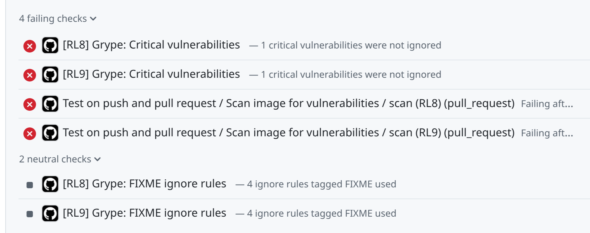

# grype-analyse

Analyse [Grype](https://oss.anchore.com/docs/guides/vulnerability/) vulnerability scan output to help investigation of critical vulnerabilities
and manage Grype ignore rules.

The `grype-analyse` tool takes Grype json output and (optionally) the
Grype configuration used for the scan and outputs:

- INFO messages for any ignore rules in the configuration which did not
    match any vulnerabilities, i.e. rules which could be deleted.
- WARNING messages for any ignore rules with "FIXME:" comments in the
    configuration which did match vulnerabilities, i.e. vulnerabilities
    which need fixing.
- ERROR messages for any critical vulnerabilities which are not ignored,
    with a summary of CVE number (where present), "native" IDs and locations
    with matches.

So a [Grype configuration](https://oss.anchore.com/docs/reference/grype/configuration/)
like this:

```yaml
ignore:
    - vulnerability: CVE-2025-68121
        package:
        location: /usr/bin/ondemand_exporter
    ...
    # FIXME:
    - vulnerability: CVE-2026-27143
    ...
```
Might produce output like this:

```
INFO: 1 ignore rules were not used:
- vulnerability: CVE-2025-68121
  package:
    location: /usr/bin/ondemand_exporter

WARNING: 1 ignore rules tagged FIXME were used:
- vulnerability: CVE-2026-27143

ERROR: 1 critical vulnerabiliies were not ignored:

CVE             Native IDs    Locations
--------------  ------------  --------------------------
CVE-2026-39821  GO-2026-5026  /usr/bin/apptainer
                              /usr/bin/ondemand_exporter
```

The "native ID" here is the ID which Grype refers to this by, i.e. what should
be used in an ignore rule.

## Usage

- Install via pip/uv.
- Run a Grype scan with json-format output, e.g.

    ```shell
    grype -c ./.grype.yaml --only-fixed "sbom:myimg-sbom.syft-json" -o json > grype.out.json
    ```
- Run `grype-analyse` passing the same Grype configuration file used for the scan:

    ```shell
    grype-analyse -c ./.grype.yaml grype.out.json
    ```

    Note that if the `-c` option is not passed to `grype-analyse` it will not
    load configuration and cannot analyse ignore rules. This is different from
    `grype` itself where it will load configuration at the default location, if
    present.

## Grype Ignore Rules

Ignore rules in Grype configuration and scan output are considered to match
based on only the following fields - all others are ignored:
- `vulnerability`
- `package.location` or `package.name`

Ignore rules can be marked as "FIXME" rules by adding a comment on the line
immediately preceeding a rule in the `ignore` configuration key. The line
must have `#` as the first non-whitespace character and must contain "FIXME:".
See example above.

## GitHub Integration

If run in a GitHub workflow the `-g` or `--github-checks` option can be used
to get `grype-analyse` to create check runs showing the status of the INFO, WARNING
and ERROR messages described in the first section. If this option is provided
the environment variable `GRYPE_ANALYSE_MATRIX` may be set to an arbitrary
string to distinguish between checks for different runs at the same SHA, e.g.
within a matrix job. Note `GITHUB_TOKEN` must be explicitly passed to the step
if not set in the job env.

Example usage:

```yaml
jobs:
  scan:
    runs-on: ubuntu-latest
    permissions:
      checks: write # required to write check run statuses
    strategy:
      matrix:
        image: ["rocky8.qcow2", "rocky9.qcow2"]
    steps:
      - name: Generate sbom and attach to release if applicable
        uses: anchore/sbom-action
        id: generate-sbom
        with:
          path: "${{ matrix.image }}"
          artifact-name: "${{ matrix.image }}}-sbom.syft-json"
          output-file: "${{ matrix.image }}-sbom.syft-json"
          format: syft-json

      - name: Scan sbom with Grype
        uses: anchore/scan-action@e1165082ffb1fe366ebaf02d8526e7c4989ea9d2 # v7.4.0
        id: scan
        with:
          sbom: "${{ matrix.image }}-sbom.syft-json"
          severity-cutoff: low
          only-fixed: true
          output-format: json
          fail-build: false

      - name: Analyse scan and fail workflow if fixed CRITICAL vulnerabilities are not ignored
        run: |
          . venv/bin/activate
          pip install git+https://github.com/stackhpc/grype-analyse@main
          grype -c .grype.yaml --only-fixed "sbom:${{ SBOM }}" -o json > grype.out.json
          grype-analyse --config .grype.yaml --github-checks grype.out.json
        env:
          SBOM: "{{ matrix.image }}-sbom.syft-json"
          GITHUB_TOKEN: ${{ secrets.GITHUB_TOKEN }}
          GRYPE_ANALYSE_MATRIX: ${{ matrix.image }}
```


Example of output from a matrix job:


